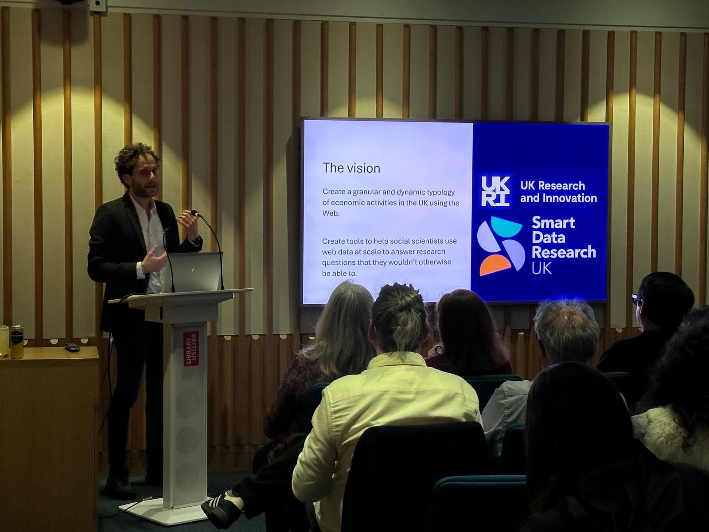
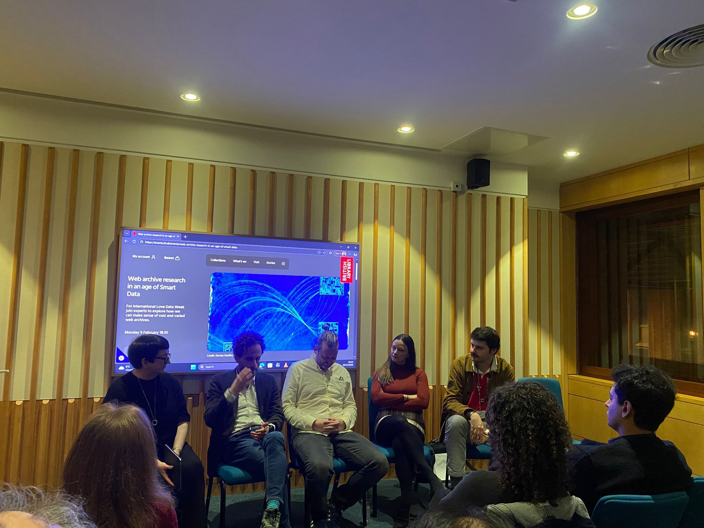
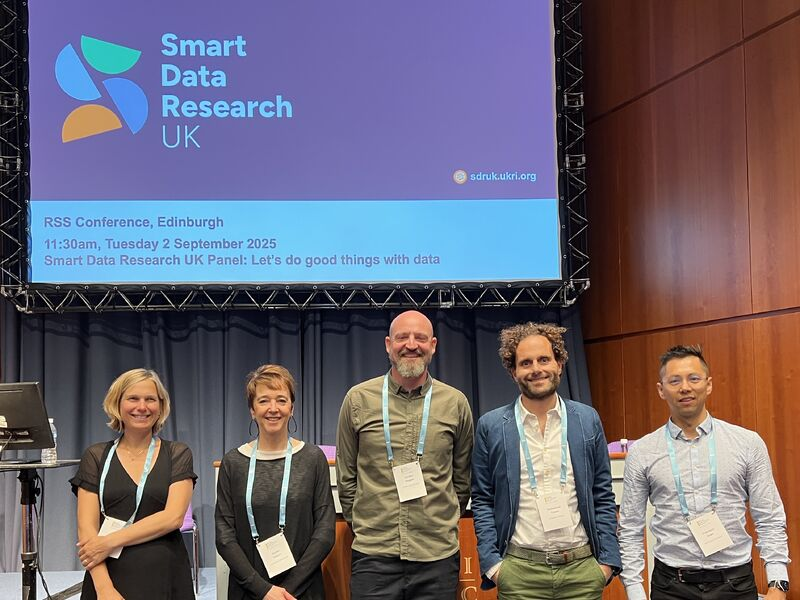

## Web Archive Research in an Age of Smart Data

Together with our partners from [UK Web Archive](https://www.webarchive.org.uk/){target="_blank"}, we co-organised a public event about Web Archive Research in an age of Smart Data. The event took place on 9 February 2026 at the British Library and it was fully booked!

The aim of the event was to showcase the web as a Smart Data. It represents the largest unstructured data collection, with a huge variety of data types, creators and sources, distributed across the world. The archived web introduces a further dimension of temporality, with national web archives also bringing questions of space to the fore.

Speakers included project lead [Emmanouil Tranos](https://etranos.info/){target="_blank"} and [Thom Vaughan](https://commoncrawl.org/team/thom-vaughan){target="_blank"} from the [Common Crawl](https://commoncrawl.org/){target="_blank"} foundation. They were joined by [Andrea Kocsis](https://www.eca.ed.ac.uk/profile/dr-andrea-kocsis){target="_blank"} and Cameron Huggett. Andrea’s exhibition with artist Dorsey Kaufmann (Edinburgh, 5 – 16 November) visualises UK Web Archive data from the National Library of Scotland. Cameron’s research into football fan publications, racism and anti-racism has included close reading of online football fan community forums as preserved in web archives. Our chair was [Jane Winters](https://www.sas.ac.uk/people/professor-jane-winters){target="_blank"}, Director of the Digital Humanities Research Hub at the University of London.

:::: {.columns}

::: {.column width="50%"}


:::

::: {.column width="50%"}



:::
::::

## British Library internal staff seminar

Emmanouil and Leonardo presented the project and our early findings in a seminar organised by the British Library for their staff. It was a great opportunity to share our work with the people who are at the forefront of web archiving and to get their feedback on our work.

## GeoInno 2026

Leonardo presented our Atlas work in a Special Session on Big Data and Machine Learning for Economic Geography during the [GeoInno 2026](https://www.geoinno2026.com/){target="_blank"} in Budapest.

{width="500px"}

## Applying LLMs and GenAI in Innovation Economics 

Leonardo presented our work and early findings in an exiting workshop organised by the Aalborg University Business School in Denmark. 

{width="500px"}

## ONS SIC Workshop, October 2025

Emmanouil and Leo took part to a workshop organised by ONS about the future of SIC codes. 
We had the opportunity to presented our work on developing a new typology of economic activities using open and reproducible workflows and web data. 

## Royal Statistical Society International Conference, Edinburgh 2025

Emmanouil took part in the panel session about *Doing Good Things with Data* during the [Royal Statistical Society International Conference 2025](https://rss.org.uk/training-events/conference-2025/){target="_blank"} in Edinburgh. 

How do we ensure this data truly represents all of society? How do we protect privacy while maximising public benefit? And most importantly, how do we translate these insights into policies that genuinely improve people’s lives? These were the themes explored during the session, which was organised by Smart Data Research UK at the recent Royal Statistical Society International Conference in Edinburgh.

{width="500px"}


## Regional Studies, May 2025

Emmanouil presented the pipeline we have developed and some very early outputs 
during the [2025 Regional Studies Association Annual Conference](https://www.regionalstudies.org/events/rsa25/){target="_blank"}. 
See the slide deck below.

<!-- ```{=html, eval=FALSE, echo=FALSE} -->
<!-- <iframe width="780" height="400" src="https://uob-my.sharepoint.com/personal/nw19521_bristol_ac_uk/_layouts/15/Doc.aspx?sourcedoc={c20615f6-15a7-492c-a239-1396bf5fef88}&amp;action=embedview&amp;wdAr=1.7777777777777777" data-external="1"  frameBorder="0"></iframe> -->
<!-- ``` -->



This was part of a very successful Special Session on *Unstructured Textual Data, Machine Learning, AI and their Applications in Regional Studies* organised by [Milad Abbasiharofteh](https://www.rug.nl/staff/m.abbasiharofteh/?lang=en){target="_blank"}, 
[Jessica Birkholz](https://www.uni-bremen.de/en/guenther/staff/team-1/dr-jessica-birkholz){target="_blank"}, 
[Tom Broekel](https://www.tombroekel.de/){target="_blank"} and [Emmanouil Tranos](https://etranos.info/){target="_blank"}. 
More info about the Special Session  [here](https://www.linkedin.com/posts/milad-abbasiharofteh-141250132_2025-rsa-annual-conference-rsa-main-activity-7274355501021237248-ey08/){target="_blank"}.

## London Data Week 2024

During the London Data Week we organised a public event about 
[Web Archives: An Untapped Source Of Smart Data](https://londondataweek.org/events/#web-archives-an-untapped-source-of-smart-data){target="_blank"}.

Despite their existence since the early days of the internet, web archives remain 
an underutilised resource with immense potential. The session raised awareness 
about the crucial role of web archives and the institutions dedicated to 
preserving digital history across various national domains. The session 
underscored the transformative potential of web archives as a source of smart 
data for social science research and beyond.

<blockquote class="twitter-tweet"><p lang="en" dir="ltr">It was pretty cool having so many people excited about <a href="https://twitter.com/hashtag/webarchives?src=hash&amp;ref_src=twsrc%5Etfw">#webarchives</a> in the same room! <a href="https://t.co/Fv3cTxVjAg">https://t.co/Fv3cTxVjAg</a></p>&mdash; Emmanouil Tranos (@EmmanouilTranos) <a href="https://twitter.com/EmmanouilTranos/status/1809285494926090393?ref_src=twsrc%5Etfw">July 5, 2024</a></blockquote> <script async src="https://platform.twitter.com/widgets.js" charset="utf-8"></script>

